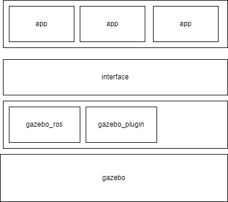

# 开发方案

## 1 功能简述

1. 在```start_pose```处生成货物，由调度控制器调度小车和机械臂将货物放上小车(位于```load_pose```)
2. 小车自主将货物运输到```end_pose```处(对于不同种类的货物，目的地是不同的，可能会设置2-3个目的地)
3. 当运抵目的地后，调度控制器调度机械臂完成货物卸载(卸载位置为```unload_pose```)，小车重新开始加入调度。
4. 小车实现自主电量管理，电量不足时及时充电，充电时小车不会被调度，充电位置为```charge_pose```

机械臂工作流程：move1 -> down1 -> grasp -> up1 -> move2 -> down2 -> release -> up2   

## 2 架构简述

项目架构主要分为interface层和app层，具有可扩展性高，耦合度低，便于开发等特点

- interface层通过```gazebo_ros```等包直接调用gazebo的服务
- app层通过调用interface的接口实现业务逻辑



## 3 数据流简述

项目通过事件传递数据，实现基本功能。

事件：由某个app发出，相关的app订阅以后对该事件进行处理。比如货物运达，小车电池耗尽等。

参数：事件发出时需要携带参数，传入处理该事件的app

app：处理事件的python脚本，注册事件的回调函数

### 3.1 参数

app触发事件时会传递参数，订阅该事件的app回调函数可以得到该参数。比如camera在触发good_appear事件以后，需要传递货物的id作为参数。而scheduler对该事件的响应需要获取到id这个参数。

#### 3.1.1 参数格式

为了开发方便，所有的参数类型定义为String，格式为```json```。例如下面是一条合法的消息：

```json
{
	"id": "001",
	"destination": 1
}
```

#### 3.1.2 参数构建

通过python的```dist```进行构建，并通过```json```包转为String。例如:

```python
data = {"id": "001", "distination":1} 
data = json.dumps(data)
msg = String()
msg.data = data
```

### 3.1.3 参数获取

通过```json```包将String转为```dist```，例如获取id

```python
data = msg.data
data = json.loads(data)
id = data["id"] # 在构建消息时也可以使用 msg["id"] = id 进行构建
```

### 3.2 事件

#### 3.2.1 cargo_appear

货物在```start_pose```出现事件(可能是摄像机捕捉到)

发布者：摄像机或者环境管理器

订阅者：scheduler

参数格式：

- id: string, 表示货物的id
- destination: int, 表示货物的目的地。货物的目的地可能有2-3个，这里给出的是目的地索引。
- start_point: int, 目前填0 

消息例子:

```json
{
	"id": "001",
    "destination": 1,
    "start_point": 0
}
```

#### 3.2.2 schedule_done

scheduler完成了调度，确定了哪一辆小车运送

发布者：scheduler

订阅者：小车, arm

参数格式：

- car_id: string, 表示小车id
- cargo_id: string, 表示货物id
- arm_id: string, 在目的地参与搬运的机械臂
- destination: int, 目的地索引

消息例子:

```json
{
	"car_id": "agv_car1",
    "arm_id": "scara_robot1",
    "cargo_id": "001",
    "destination": 1
}
```

#### 3.2.3 car_arrive

小车到达start_pose或者end_pose，此时机械臂需要从小车上卸载或者装载货物。如果机械臂已经运动到指定地点，则直接进入down1，否则需要等待move1完成

发布者：小车

订阅者：arm

参数格式：

- arm_id: string, 表示要求运动的机械臂

消息例子:

```json
{
	"arm_id": "scara_robot1"
}
```


#### 3.2.4 charge_require

小车需要充电，此时调度器不再调度小车

发布者：小车

订阅者：scheduler

参数格式：

- car_id: string, 表示小车id

消息例子:

```json
{
	"car_id": "scara_robot1"
}
```

#### 3.2.5 charge_done

小车充电完成，此时小车重新加入调度 

发布者：小车

订阅者：scheduler

参数格式：

- car_id: string, 表示小车id

消息例子:

```json
{
	"car_id": "agv_car1"
}
```

#### 3.2.5 unload_done

机械臂抓起货物上升，此时卸载货物的小车可以离开进入等待区，或者运送下一个货物

发布者：arm

订阅者：小车, scheduler

参数格式：

- arm_id: string, 表示机械臂id

消息例子:

```json
{
	"arm_id": "scara_robot1"
}
```

#### 3.2.5 load_done

机械臂空载上升，此时装载货物的小车可以离开```start_pose```

发布者：arm

订阅者：小车, scheduler

参数格式：

- arm_id: string, 表示机械臂id

消息例子:

```json
{
	"arm_id": "scara_robot1"
}
```

### 3.3 app

#### 3.3.1 全局数据

该数据视为已知数据

- 配置了目的地信息

```python
[
    {"arm_id": string, "position": Pose},
]
```

- 出发点信息:  

```python
[
	{"arm_id": string, "position": Pose}
]
```

#### 3.3.2 car_app

状态：

- run: 正在运输中
- wait: 等待装载或者充电
- ready: 在空闲区等待

可能需要记录的数据:

- 货物id
- car id
- 与其协作的机械臂id
- 出发点和目的地，要求记录索引。准确的地址需要查表。

#### 3.3.3 arm_app

状态:

- move1: 移动到装载的位置
- down1: 放下机械臂
- grasp: 夹具抓紧
- up1: 升起机械臂
- move2: 移动到卸载位置
- down2: 放下机械臂
- release: 夹具松开
- up2: 升起机械臂

可能需要记录的数据：

- 自身id

#### 3.3.4 scheduler_app

可能需要记录的数据:

- 所有机械臂的状态
- 所有小车的状态，是否是ready
- 所有task状态，包括该次运输任务的小车，目的地，是否完成等等

#### 3.3.5 env_app

运行app以后，生成模型，并且发布一条schedule_done的消息

## 4. interface 说明

### 4.1 ```ScaraInterface```

构造函数:

```python
ScaraInterface(controller_name, robot_name, robot_pose, r1_pose, r2_pose):
    """
    创建scara控制器

    Input:  controller_name - 控制器节点名称
            robot_name - 控制器对应的机械臂名称
            robot_pose - scara机械臂所在位置
            r1_pose    - rotation1的初始位置
            r2_pose    - rotation2的初始位置    
    """
```

#### 4.1.1 ```move_to(pose)```

功能：计算机械臂需要的力并且发布

输入：
- pose: Pose, 表示机械臂末端运动的目的地，可以通过Pose(position=Point(x,y,z))来构造

#### 4.1.2 ```move_up()```

功能：调整机械臂为上升状态，注意如果不调用update()就无法发布力，机械臂末端会掉下来

#### 4.1.3 ```move_down()```

功能：调整机械臂为下降状态

#### 4.1.4 ```grasp()```

功能：调整机械臂为抓紧状态，注意如果不同时调用update()就无法发布力，机械臂无法维持该状态

#### 4.1.5 ```release()```

功能：调整机械臂为松弛状态

#### 4.1.6 ```update()```

功能：发布机械臂上升和夹具抓紧的力。推荐的使用方法是在循环中首先调用grasp()以及move_up()，最后调用update()，实现机械臂抓紧+上升状态。

### 4.2 ```AgvInterface```

构造函数:
```python
AgvInterface(interface_name, car_name):
        """
        构造函数
        
        Input:  interface_name - 接口名称
                car_name - 小车名称 
        """
```

#### 4.2.1 ```move_to(pose)```
        
功能: 异步的move函数, 不会等待到达目的地
        
输入:  
- pose: Pose, 目的地

#### 4.2.2 ```feedback_cb(self, result)```

功能: move_to在完成过程中的回调函数，可以重新编写

#### 4.2.3 ```done_cb(self, state, result)```

功能: move_to到达之后的回调函数，可以重新编写

具体的使用例子可以看app

### 4.3 ```SchedulerInterface```

构造函数：

```python
SchedulerInterface(scheduler_name):
    """
    构造函数

    Input:  scheduler_name - string, 调度器名称
    """
```

### 4.4 ```EnvInterface```

构造函数:

```python
EnvInterface(interface_name):
    """
    构造函数

    Input:  interface_name - 接口的名称
    """
```

### 4.4.1 ```spawn_model```

功能: 在gzebo中生成一个模型

输入:
- model_name: string, 模型的名称
- model_xml: string, 模型文件
- name_space: string, 命名空间
- pose: Pose, 生成的位置，可以通过Pose(position=Point(x,y,z))来构造

## 5. 开发进度安排

|时间|目标|
|-|-|
|2.1|安装开发环境|
|2.2, 2.3, 2.4, 2.5|实际开发|
|2.6, 2,7|联调|

## 6. 分工

|内容|开发者|
|-|-|
|scheduler|宋金翰|
|arm      |王文斌|
|car/charge|张秉文|
|car/move  |马川淇|    
|env       |梁馨如|
|创新点|邹宇晗，何科霖，余泓澳|

## todo
1. 充电桩

## 开发例子

举个例子，比如说我需要开发arm的app，那么首先继承```ScaraInterface```，然后在对应的事件中添加回调函数。具体来说，arm需要在schedule_done的时候移动到start_pose，因此需要实现schedule_doen事件的回调函数。移动的方式是调用```self.move_to(pose)```

```python
#! /usr/bin/env python
# -*- coding: utf-8 -*

import rospy
import json
from scara_interface import ScaraInterface
from geometry_msgs.msg import Pose, Point
from std_msgs.msg import String
from enum import IntEnum

class App(ScaraInterface):
    def __init__(self, controller_name, robot_name, robot_pose, start_pose, end_pose, r1_pose, r2_pose):
        ScaraInterface.__init__(self, controller_name, robot_name, robot_pose, r1_pose, r2_pose)
        
        self.start_pose = start_pose
        self.end_pose = end_pose
        
        self.publisher = rospy.Publisher("load_done", String, queue_size=10)
        
        self.car_arrive = True # 小车是否到
        self.target_loop_num = 0 # 目标循环次数
        self.cur_loop_num = 0 # 计算循环次数 
        self.cur_state = state.wait1 # 当前的状态
        self.cur_action = self.wait # 当前状态执行的函数
        self.time_unit = 0.01 # 每次循环的时间单位

        self.func_tbl = {
            state.wait1: (state.move1, self.move1     , 1.50),
            state.move1:   (state.down1, self.move_down , 0.25),
            state.down1:   (state.grasp, self.grasp     , 0.05),
            state.grasp:  (state.up1  , self.move_up   , 0.25),
            state.up1:    (state.move2 , self.move2,     1.50),
            state.move2:  (state.wait2, self.wait    , 0.00),
            state.wait2:  (state.down2 , self.move_down, 0.25),
            state.down2:  (state.release, self.release , 0.05),
            state.release: (state.up2   , self.move_up  , 0.25),
            state.up2:     (state.wait1   , self.wait  , 0.25),
        }

    def move1(self):
        self.move_to(self.start_pose)
        
    def move2(self):
        self.move_to(self.end_pose)

    def schedule_done(self, msg):
        """
        定义回调函数, 在schedule_done的时候调用 
        """
        data = msg.data
        rospy.loginfo(data)
        data = json.loads(data)
        
        if data["arm_id"] != self.robot_name:
            return
        rospy.loginfo(data["arm_id"])
        while not rospy.is_shutdown():
            rospy.loginfo(self.cur_state)
            if self.cur_state == state.wait1:
                if not self.car_arrive:
                    continue
                else:
                    self.car_arrive = False
            if self.cur_loop_num == self.target_loop_num: # 到达该状态的循环次数，则更新状态
                self.cur_state, self.cur_action, time_cost = self.func_tbl[self.cur_state]
                self.target_loop_num = time_cost//self.time_unit
                self.cur_loop_num = 0
            else:
                self.cur_action()
                self.cur_loop_num += 1
            
            self.update()

            rospy.sleep(self.time_unit)


        # 发布一条信息，表示机械臂完成了搬运
        msg = {"arm_id": self.robot_name}
        msg = json.dumps(msg)
        self.publisher.publish(msg)
        
if __name__ == "__main__":
    # 添加一些参数
    app = \
        App(
            controller_name=args.cn, 
            robot_name=args.rn, 
            robot_pose=Pose(position=Point(args.rpx, args.rpy, args.rpz)),
            start_pose=Pose(position=Point(args.spx, args.spy, args.spz)),
            end_pose=Pose(position=Point(args.epx, args.epy, args.epz)),
            r1_pose=args.r1p,
            r2_pose=args.r2p
        )
    
    rospy.logdebug(app.start_pose.position.x)
    rospy.Subscriber("schedule_done", String, app.schedule_done)
    rospy.spin() # 这里是阻塞函数，等待callback被调用
```

更加具体的如何发布事件(就是topic)和注册事件的回调函数可以看：[https://blog.csdn.net/zlb_zlb/article/details/103444360](https://blog.csdn.net/zlb_zlb/article/details/103444360)